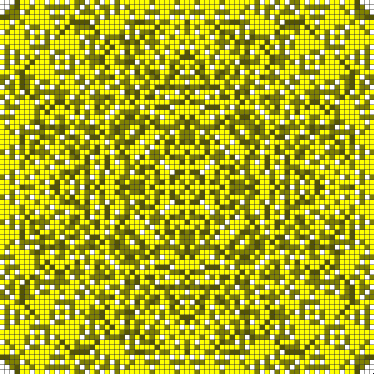
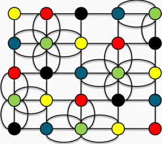

# Sandpile



Animates the evolution of an Abelian Sandpile on a finite two-dimensional integer lattice over discrete timesteps.

The sandpile is only one instance of an entire class of cellular automata which this project supports. 
The rendering and control logic is defined such that it correctly handles a generic two-dimensional cellular automaton of arbitrary finite size, so long as its transition function does not modify anything but the cell states (see [Structure](#structure) and `CellularAutomaton.ts` for more details).

## Status
Project is ***live*** at: <https://jamais-vu.github.io/sandpile/>.
Check it out!

## Contents
1. [Background](#background)
    1. [Motivation](#motivation)
    2. [Sandpile Model](#sandpile-model)
        1. [Transition Function](#transition-function) 
2. [Structure](#structure)
3. [Usage](#usage)
    1. [Usage Details](#usage-details)
    2. [View on Web](#view-on-web)
    3. [Local Server](#local-server)
4. [Future Development](#future-development)
    1. [Parallel Programming](#parallel-programming)
    2. [Graph generalization](#graph-generalization)
5. [References](#references)

## Background

### Motivation

I became interested in the [Abelian Sandpile Model](https://en.wikipedia.org/wiki/Abelian_sandpile_model) and other cellular automata after finishing my first JavaScript project, an interactive [Game of Life](https://github.com/jamais-vu/gol-webapp). The sandpile has a more complex transition function, and I wanted to see how much better I could do now that I had some experience with JavaScript.

I chose TypeScript because I had never used it before, and learning it felt like a natural next step after becoming comfortable with JavaScript. I'm very happy with that decision; TypeScript is great, it forces me to write clearer code and prevented many errors that would have otherwise occurred had I used JavaScript.

I also wanted to familiarize myself with [`mocha`](https://mochajs.org/) and [`chai`](https://www.chaijs.com/), and get in the habit of unit testing my project code as I write it.

### Abelian Sandpile Model

The Abelian Sandpile Model is a cellular automaton consisting of an _n_ x _m_ grid of cells. Each cell has an associated non-negative integer (the *state* of the cell) representing how many grains of sand are on that cell.

Each cell has up to four [*neighbors*](https://en.wikipedia.org/wiki/Von_Neumann_neighborhood): the cells directly above, left, right, and below it. 

```
Neighbors of the cell (x, y):

+------------+------------+------------+
|            | (x, y + 1) |            |
+------------+------------+------------+
| (x - 1, y) |   (x, y)   | (x + 1, y) |
+------------+------------+------------+
|            | (x, y - 1) |            |
+------------+------------+------------+
```

A cell on a side of the grid has three neighbors, and a cell on a corner of the grid has two neighbors. (This is in contrast to Game of Life, which defines the neighbors of a given cell to be [all eight adjacent cells](https://en.wikipedia.org/wiki/Moore_neighborhood).)

#### Transition Function 

In addition to the grid of cells, the Sandpile also has a *transition function`*. The transition function uses the current (time *t*) state of each cell in the grid to determine the next  state of the cell.

TODO: This could be more clear.

1. We add one grain to an arbitrary cell of the grid. 
2. If every cell in the grid is *stable* (has at most three grains), then the grid as a whole is stable. In this case, the state transition is complete, and we are in the resultant state.
3. If at least one cell in the grid is *unstable* (has four or more grains), then the grid is unstable.<sup>1</sup>
4. We pick an arbitrary unstable cell<sup>2</sup> and *topple* it: reduce its grain count by four, and add one grain to each of its neighbors. For cells which have four neighbors, this process does not alter the total count of grains in the grid; however, for cells on the sides or corners of the grid this process decreases the total count of grains in the grid. They "fall off" the edges.<br>
5. When we topple an unstable cell, the grain added to each neighbor may make one or more of those neighbors also unstable. We topple these newly-unstable cells (an *avalanche*), which in turn may produce even more unstable cells, and so on.
6. After all that toppling, the grid will eventually be stable<sup>3</sup>. Then the transition function has finished.<br>
    <details> <summary>*Click to expand transition function footnotes*</summary>
    1: Technically, when we reach part (3) for the first time, there is at most one cell which could be unstable: the cell we added a grain to.<br>
    2: The final stable state of the grid is not dependent on the order in which we topple unstable cells; i.e. toppling of cells is commutative (see Theorem 2.1 of ref [[1]](#ref-identity-of-abelian-sandpile-group) if you want a proof of this). In other words, a grid has only one possible final stable state, and this state is uniquely-determined as soon as the transition function adds one grain to the grid, before even a single unstable cell has been toppled.<br>
    3: (TODO: It's intuitive to me but I'd like a simple proof to include here.)<br>

    </details>

So the grid is stable at each timestep -- even though it may have contained an extremely-large number of unstable cells during the transition, the transition itself is not "at" a timestep.

## Structure

The application's entry point, `script.ts`, sets up a [Presentation-Abstraction-Control](https://en.wikipedia.org/wiki/Presentation%E2%80%93abstraction%E2%80%93control) (PAC) framework: 

```text
                            User Interface
                                  |
                                  | UIEvents trigger EventListeners.
                                  | EventListeners trigger Controller method 
                                  | calls.
                                  |
                                  v
                      ------- Controller -------
Calls step methods.  |                         |  Passes CellularAutomaton state
Gets grid/cells      |                         |    CellularAutomaton state
  states.            |                         |    values.
                     v                         v
            CellularAutomaton               Drawing
              (Abstraction)              (Presentation)
```

- **Presentation**: `Drawing` class
    - Renders gridlines and cell states on the canvas.
    - Only thing it "touches" outside itself is its given canvas rendering context.
- **Abstraction**: `CellularAutomaton` class
    - Handles transition logic of the cellular automaton.
    - Manages the complete history of the cellular automaton's state.
- **Control**: `Controller` class 
    -  Interface between the UI layer and the Model+View.
    -  Class methods are called by `EventListeners` added in `script.ts`.
    -  Calls `CellularAutomaton` class methods and gets `CellularAutomaton` state data
    -  Passes `CellularAutomaton` state data to `Drawing` class methods.

TODO: Explain the secondary modules, and how we implement the sandpile in this framework.

## Usage

You can view the animation on the web, or clone this repository and host your own HTTP server. 

### Usage details:

- By default, `script.ts` initializes the sandpile `CellularAutomaton` with a transition function which adds new grains to the center of the grid (rather than to a random cell).

- The demo starts paused. 

- Jumping forward several thousand steps at once may take a few seconds, and jumping forward more than 10,000 steps at once may cause it to stop responding (I hope to make that faster in the future). 

### View on Web

- View the sandpile animation at this project's [GitHub Pages deployment](https://jamais-vu.github.io/sandpile/).
- The application is also live at [Replit](https://abelian-sandpile-model.jamaisvu.repl.co/), but that one is not guaranteed to be up-to-date.

### Local Server

Run this simulation on your computer by cloning the repository and hosting `index.html` on a local server.

<details>
<summary>Expand this if you want to host it locally, but are unfamiliar with how to do so.</summary>

I use the NodeJS package [`http-server`](https://github.com/http-party/http-server), because it's very simple.

```bash
# In the directory where you want to save this repository
$ git clone https://github.com/jamais-vu/sandpile

# If you don't have the http-server package.
$ npm install http-server

# Navigate to the sandpile directory.
$ cd sandpile
e
# Start the HTTP server. It automatically uses 'index.html'
# The '-c-1' option disables caching (useful if you are editing the web page).
$ http-server -c-1

# When you are done, you can stop the HTTP sever by pressing Ctrl+C.
```

After starting the server, navigate your web browser to <http://localhost:8080/index.html> and you're done.
</details>

## Future Development

### Re-implement Game of Life using `CellularAutomaton`

Would be a strong proof-of-concept and I'd probably learn even more about abstraction.

Using the `Controller` and `Drawing` classes we define here would probably significantly improve structure and organization of `gol-webapp`, too.


### Parallel Programming 

Since toppling a cell in the grid only affects that cell's immediate neighbors, we can [partition](https://en.wikipedia.org/wiki/Partition_of_a_set) the grid into several subsets of cells, where any two cells in the same subset are _independent_ (do not share neighbors). This means that, for each subset, we can simultaneously topple all cells in the subset without worrying about potential conflicts from concurrent topple processes accessing or modifying the same neighbor.  
     
   <sub>*Partition of a 5 x 5 grid. No two cells of the same color share a neighbor.*</sub><br>
   <sub>*(Image credit: P. Vahagn, P. Suren, and N. Hayk [[2]](#ref-parallel-sandpile))*</sub>

I want to do this because it's a neat solution, and I'd like to become more familiar with parallel programming.

#### Status

-  `createVertexGroups`, the function for creating independent subsets, passes tests. Have been experimenting with breaking up the transition functions to accept subsets of a grid, but I'll need to figure out how to call them in parallel to test them.

-  Plan to check out [`Promise`](https://developer.mozilla.org/en-US/docs/Web/JavaScript/Reference/Global_Objects/Promise). I'm not clear on whether that's truly "parallel" but it may suffice. May also play around with [Web Workers](https://developer.mozilla.org/en-US/docs/Web/API/Web_Workers_API).

### Graph generalization of Sandpile grid

Instead of a two-dimensional integer lattice, where each cell has 4 neighbors, the Sandpile is represented by an undirected finite multigraph, where each vertex has an arbitrary number of neighbors. A vertex in the graph topples if its grain count is equal to or greater than its number of neighbors.

Unlike the grid, there is no "edge" for grains to fall off and be lost from the sandpile, so a single vertex is chosen to be the "sink" and does not topple no matter how many grains are placed on it.

#### Status

- Basic recursive implementation seems to work for very small graphs. For any graphs of an interesting size, it quickly exceeds the maximum call stack size. I like how concise the recursive implementation is, but I'm not sure there's a nice solution to avoid hitting the call stack limit, so I'm working on an iterative implementation.

- After I test that it's working, I'd like to visualize the vertices and edges, and animate transitions. That sounds like a good challenge; more complex than drawing a bunch of rectangles.

## References
[1]<a name="ref-identity-of-abelian-sandpile-group"></a> N. Doman, "The Identity of the Abelian Sandpile Group", Bachelor Thesis in Mathematics, Faculty of Science and Engineering, University of Groningen, Groningen, Netherlands, 2020. Available: https://fse.studenttheses.ub.rug.nl/21391/. 

[2]<a name="ref-parallel-sandpile"></a> P. Vahagn, P. Suren, and N. Hayk,  "The Investigation of Models of Self-Organized Systems by Parallel Programming Methods Based on the Example of an Abelian Sandpile Model", in Proceedings of CSIT 2013: 9th International Conference on Computer Science and Information Technologies, 23-27 September, 2013, Yerevan, Armenia. Available: https://csit.am/2013/proceedings.php.
